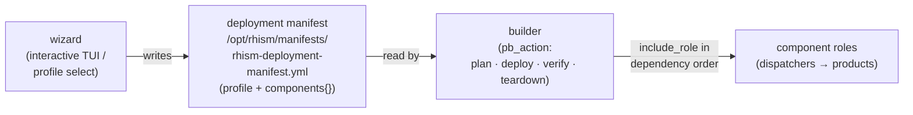
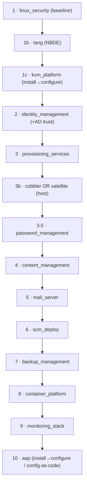

# rhism Build Catalogue

**One place to interrogate the whole build process.** For every rhism build this
page shows the *consolidated outcome* — what a successful run stands up — and lets
you drill down into each component role and its artefacts (README, depth doc,
requirements, tests). It is the map from **a product choice → an end state → the
roles and evidence behind it**.

> Grounded in the `rhism.platform` collection source as of 2026-07-18. Where a
> component or outcome is stated here, it traces to a real file (cited in
> [§6 Source index](#6-source-index)); nothing is aspirational. Coverage gaps are
> listed honestly in [§5](#5-coverage--honesty-lists), not papered over.

---

## 1. How a build works (wizard → manifest → builder → components)

rhism builds in three stages inside one self-contained collection
(`galaxy.yml`: `namespace: rhism`, `name: platform`, no external dependencies):

- **`wizard`** resolves a **profile** (or a fully interactive path) into a manifest
  — a `profile` name plus a `components{}` map of 13 component families, each with
  an `enabled` flag and a product `type`.
- **`builder`** reads that manifest and dispatches the enabled component roles in a
  fixed **dependency order**, each gated on its manifest decision.
- Every component is either a **dispatcher** (selects one product from a family via
  a `*_type` var) or a concrete **product / capability / orchestrator** role.

Two things make the process safe to interrogate and re-run:
- **Decisions are resolved once, as facts** (`builder/tasks/deploy.yml`): each
  component's `enabled`/`type` is computed a single time (override → manifest →
  coded default), printed, and asserted (13 enable keys, 10 type keys) before any
  role runs.
- **Dry-run by default**: the global `pb_deploy_execute` gate (default `false`) is
  threaded into every child role's `*_execute` var — a real deploy is a deliberate
  `pb_deploy_execute: true`.

---

## 2. Builds (profiles) and their consolidated outcomes

Selectable builds are the wizard **profiles** (`roles/wizard/files/profiles/`),
chosen via `wizard_profile`. Two profiles exist today; the rich per-component
product choice is the second selection surface (it lives in the manifest /
dispatchers, not in extra profile files).

| Build | `wizard_profile` | Licence | Consolidated outcome |
|---|---|---|---|
| **Governed RHEL Estate** | `estate` | required (`true`) | The RHIS management-plane spine as one manifest-driven build (see below). |
| **Custom** | `custom` / `""` | not required | No fixed end state — whatever the operator selects across the 13 families in the interactive wizard pages. |

### 2.1 Build: **Governed RHEL Estate** (`estate`)

Enabled set (from `estate.yml`): `security`, `tang`, `hypervisor=kvm`,
`identity=rh_idm`, `provisioning=satellite_proxy`, `content=satellite`,
`automation=aap`. A successful `pb_action=deploy pb_deploy_execute=true` stands up,
**in dependency order**:

1. **Hardened RHEL baseline** on all hosts — `linux_security` (CIS/STIG-aligned).
2. **NBDE / Tang key-escrow** servers for disk unlock — `tang`.
3. **KVM / libvirt hypervisor(s)** as the compute substrate — `kvm_platform`.
4. **Red Hat IdM** identity plane (realm, DNS, certs) — `identity_management` → `rh_idm`.
5. **Satellite capsule / smart-proxy** provisioning fabric — `provisioning_services` → `satellite_proxy` (bare-host provisioning via Satellite `action=host`).
6. **Satellite content lifecycle** (repos / content views / lifecycle) — `content_management` → `satellite`.
7. **Ansible Automation Platform** control plane, installed and configured as code — `aap` (the *capstone*, deployed last, on top of the identity/content/compute it manages).

**Not** included by this profile (all `enabled: false` in `estate.yml`): secrets
management, mail, SCM, backup, container platform, monitoring — those are the
optional day-2 stack the **custom** build unlocks.

Sizing tiers **S / M / L** (`wizard_estate_sizing_tier`, default `l`) size the
identity / content / hypervisor / tang host counts via `estate.yml` `sizing_defaults`.

### 2.2 Build: **Custom**

`components: {}` — no fixed end state. The operator selects across all 13 families
in the interactive wizard pages (`roles/wizard/tasks/pages/`: licensing, hypervisor,
identity, content, provisioning, scm, backup, secrets, container, mail, network,
sizing, credentials, review). The builder then runs the **same dependency-ordered
pipeline** (§3), gated to only the enabled subset — this is the path to the full
day-2 stack the estate profile leaves off.

---

## 3. Builder lifecycle and dependency order

`builder` validates `pb_action` against `[plan, deploy, verify, teardown]` and
dispatches to the matching task file:

| `pb_action` | Effect |
|---|---|
| **plan** (default) | Loads the manifest; prints enabled/skipped components + the fixed order. No changes. |
| **deploy** | Resolves decisions once, then `include_role` each enabled component in order. Dry-run unless `pb_deploy_execute: true`. |
| **verify** | Service + HTTP/API probes per enabled component (libvirtd, IPA/HTTPS, Postfix/SMTP:25, gitlab-ctl, k8s API, AAP `/api/controller/v2/ping/`). |
| **teardown** | Best-effort service stop in **reverse** order (packages/data left intact); destructive-pause gate. |

The deployment pipeline (the iterated component list) and its rationale
— *security baseline → key escrow → compute → identity → provisioning/content →
day-2 services → AAP last as the estate capstone*:

**Default product types** (when a family is enabled without an explicit choice):
hypervisor=kvm, identity=freeipa, provisioning=dnsmasq, secrets=ansible,
content=foreman, mail=relay, scm=gitlab_ce, backup=restic, container_platform=k3s,
automation=aap. *(The `estate` profile overrides identity→rh_idm,
provisioning→satellite_proxy, content→satellite.)*

---

## 4. Component catalogue (drill-down)

Every role the builder can deploy, with its kind, family/products, and artefact
coverage. **Artefacts**: RM = README · REQ = REQUIREMENTS.yml · mol = molecule
scenario count · depth = depth doc · reg = dedicated entry in the platform test
register (`roles/cmdb/vars/platform_tests.yml`). ✓ present · ✗ absent · `n` = count.
READMEs live at `../roles/<name>/README.md`.

### 4.1 Dispatcher families (pick one product per family)

| Family (dispatcher) | `*_type` → products | RM | REQ | mol | depth | reg |
|---|---|:--:|:--:|:--:|:--:|:--:|
| **identity_management** | `idm_type` → **rh_idm** \| **freeipa** (+AD trust) | ✓ | ✓ | 2 | ✓ | ✗ |
| **provisioning_services** | `prov_type` → **dnsmasq** \| **cobbler** \| **satellite_proxy** \| **foreman_proxy** | ✓ | ✓ | 1 | ✓ | ✗ |
| **content_management** | `content_type` → **satellite** \| **foreman** | ✓ | ✓ | 2 | ✓ | ✗ |
| **mail_server** | `mail_type` → **mail_relay** \| **mail_full** | ✓ | ✓ | 1 | ✓ | ✗ |
| **scm_deploy** | `scm_type` → **gitlab_ce** \| **gitlab_ee** | ✓ | ✓ | 1 | ✓ | ✗ |
| **backup_management** | `backup_type` → **restic** \| **bareos** \| **rear** \| **oadp** | ✓ | ✓ | 1 | ✓ | ✗ |
| **container_platform** | `cp_type` → **ocp** \| **okd** \| **k3s** \| **rke2** (+ `storage_*`/`ingress_*`/`registry_*` sub-dispatch) | ✓ | ✓ | 1 | ✓ | · |
| **password_management** | `pm_type` → **pm_ansible** \| **pm_vault** \| **pm_thycotic** | ✓ | ✓ | 1 | ✗ | ✗ |

**Product roles** selected by those families:

| Product | Family | Purpose | RM/REQ/mol/depth/reg |
|---|---|---|---|
| `rh_idm` | identity | Red Hat IdM/IPA server (subscribed) | ✓/✓/1/✓/· |
| `freeipa` | identity | FreeIPA server | ✓/✓/·/✓/D |
| `cobbler` | provisioning | Light PXE / no-Satellite provisioning | ✓/✓/1/✓/· |
| `satellite_proxy` | provisioning | Satellite capsule / smart proxy | ✓/✓/1/✓/· |
| `foreman_proxy` | provisioning | Foreman smart proxy | ✓/✓/1/✓/✗ |
| `satellite` | content | Satellite content lifecycle + `action=host` provisioning | ✓/✓/1/✓/D |
| `foreman` | content | Foreman content/host management | ✓/✓/1/✓/✗ |
| `mail_relay` | mail | Postfix smarthost/relay | ✓/✓/2/✓/D |
| `mail_full` | mail | Postfix+Dovecot+DKIM+SpamAssassin+ClamAV | ✓/✓/1/✓/D |
| `gitlab_ce` | scm | GitLab Community Edition | ✓/✓/1/✓/✗ |
| `gitlab_ee` | scm | GitLab Enterprise (subscribed) | ✓/✓/1/✓/· |
| `restic` | backup | Restic repo-based backup | ✓/✓/2/✓/✗ |
| `bareos` | backup | Bareos dir/sd/fd backup | ✓/✓/1/✓/D |
| `rear` | backup | ReaR bare-metal disaster recovery | ✓/✓/2/✓/✗ |
| `oadp` | backup | OpenShift API for Data Protection (Velero) | ✓/✓/1/✓/✗ |
| `k3s` | container_platform | k3s Kubernetes | ✓/✓/2/✓/✗ |
| `rke2` | container_platform | RKE2 Kubernetes | ✓/✓/1/✓/✗ |
| `okd` | container_platform | OKD (community OCP) | ✓/✓/1/✓/✗ |
| `ocp` | container_platform | OpenShift Container Platform | ✓/✓/1/✓/· |
| `storage_local_path` / `storage_nfs` / `storage_longhorn` / `storage_ocs` | container_platform (storage) | k8s storage classes | ✓/✓/1–2/✓/✗ |
| `ingress_default` / `ingress_nginx` / `ingress_traefik` / `ingress_haproxy` | container_platform (ingress) | k8s ingress controllers | ✓/✓/1/✓/✗ |
| `registry_internal` / `registry_generic` | container_platform (registry) | in-cluster / external registry | ✓/✓/1/✓/✗ |
| `pm_ansible` | password | Ansible-vault credential backend | ✓/✓/1/✗/· |
| `pm_vault` | password | HashiCorp Vault backend | ✓/✓/2/✗/✗ |
| `pm_thycotic` | password | Thycotic/Delinea backend | ✓/✓/1/✗/✗ |

### 4.2 Direct products, capabilities & orchestrators (no dispatcher family)

| Role | Kind | Purpose | RM/REQ/mol/depth/reg |
|---|---|---|---|
| `kvm_platform` | product | KVM/libvirt hypervisor (install+configure) | ✓/**✗**/1/✓/✗ |
| `tang` | product | Tang/NBDE key-escrow (quadlet) | ✓/✓/1/✓/✗ |
| `aap` | product | AAP install + config-as-code — the estate capstone | ✓/✓/1/✓/✗ |
| `linux_security` | orchestrator | Composes the `linux_*` security sub-roles | ✓/✓/1/guide/· |
| `linux_hardening` | capability | CIS/STIG hardening | ✓/✓/1/✗/✗ |
| `linux_auditing` | capability | auditd config | ✓/✓/1/✗/✗ |
| `linux_selinux` | capability | SELinux enforcement | ✓/✓/1/✗/✗ |
| `linux_users` | capability | User/account baseline | ✓/✓/1/✗/✗ |
| `linux_packages` | capability | Package baseline | ✓/✓/1/✓/✗ |
| `firewall` | capability | Host firewall | ✓/**✗**/1/**✗**/· |
| `monitoring_stack` | orchestrator | Monitoring (nagios/splunk/elastic) | ✓/✓/1/✓/· |
| `rhel_subscription` | capability | RHSM registration (reused widely) | ✓/**✗**/1/✓/✗ |
| `rhism_inventory` | capability | Estate inventory source (SOE catalogue) | ✓/✓/1/✓/✗ |
| `rhism_ui` | product | Security-hardened web UI (manifest builder) via `roles/podman` | ✓/✓/1/✗*/✗ |
| `wizard` | orchestrator | Interactive TUI → manifest generator | ✓/✓/2/✗/D |
| `builder` | orchestrator | Manifest → dependency-ordered deployer | ✓/✓/4/✗/D |

---

## 5. Coverage & honesty lists

Real gaps, surfaced so this catalogue is a source of truth rather than a marketing
sheet. These are candidate backlog items, not deployment blockers.

- **Missing `REQUIREMENTS.yml`**: `kvm_platform`, `firewall`, `rhel_subscription`.
- **Missing depth doc**: `builder`, `wizard`, `firewall`, `password_management`
  + all `pm_*`; the `linux_hardening/auditing/selinux/users` roles are covered only
  by the combined `linux-security-guide.md`; `rhism_ui`'s depth doc is referenced as
  `rhism-ui.md` but a `rhism-builder-ui.md` exists instead (name mismatch, marked `✗*`).
- **Test-register coverage**: only `wizard`, `builder`, `bareos`, `mail_full`,
  `mail_relay`, and `freeipa` have **dedicated** `component:` entries in
  `roles/cmdb/vars/platform_tests.yml`. Most component/product roles have only
  substring mentions (`·`) or none (`✗`). This is the platform-wide test register,
  so sparse rhism coverage is a *testing-evidence* gap to close as real functional
  runs land — not proof the roles are untested at unit/molecule level (most carry
  their own molecule scenarios, see the `mol` column).
- **Stale collection README**: `collections/rhism/platform/README.md` "## Roles"
  table lists only `rhism_ui`, contradicting the 55-role tree and `galaxy.yml`.
  Worth a refresh to point at this catalogue.

---

## 6. Source index

Every claim above is verifiable from:

- **Profiles**: `roles/wizard/files/profiles/{estate,custom}.yml`; selection in `roles/wizard/defaults/main.yml`; interactive pages `roles/wizard/tasks/pages/`.
- **Builder lifecycle & order**: `roles/builder/{vars/main.yml, tasks/main.yml, tasks/deploy.yml, tasks/plan.yml, tasks/verify.yml, tasks/teardown.yml, defaults/main.yml}`.
- **Dispatcher type lists**: each dispatcher's `vars/main.yml` (`_*_valid_types`); wiring in each `tasks/*.yml` (`include_role: name: "{{ *_type }}"`).
- **Intent & data model**: `docs/rhism-project-intent.md`, `docs/rhism-alignment-plan.md`, `docs/rhism-variable-model.md`; collection `README.md` + `galaxy.yml`.
- **Test register**: `roles/cmdb/vars/platform_tests.yml` (dedicated `component:` keys).

---

*Maintenance: regenerate the §4 coverage columns whenever a role gains/loses an
artefact, and add a build row in §2 when a new wizard profile lands. Each component's
own README + depth doc remain the detailed reference — this page is the index over
them.*
