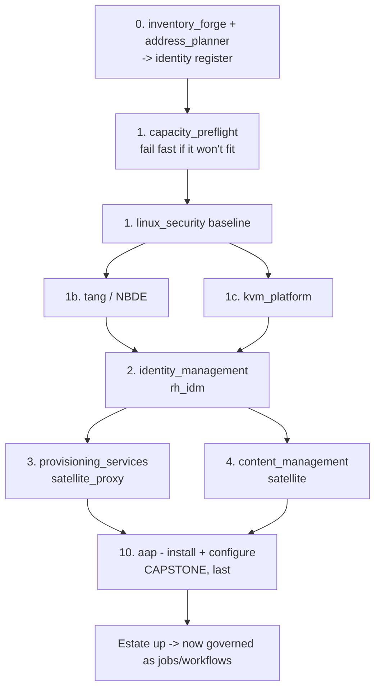

# rhism — end-to-end build report (from nothing)

How a complete **rhism Governed RHEL Estate** is built from zero — every component
in the order it is actually called, the role that builds it, the variable that
selects it, and what gates a real deploy. Grounded in the real dispatch:
`roles/builder/tasks/deploy.yml`, the estate profile
`roles/wizard/files/profiles/estate.yml`, and the estate CaC
`playbooks/vars/estate_cac.yml`.

> **Two modes, one content (dual-mode).** Every step below runs two ways:
> **ansible-core-light** — `ansible-playbook rhism.platform.deploy` runs the
> builder directly, no control plane required; and **the whole shebang** — the
> same content governed as AAP jobs/workflows (see *§5 Governed*). The build logic
> lives in the roles; AAP only adds governance on top.

---

## Before you begin — credentials you must provide

A real deploy against Red Hat products needs **three secrets**. The build **never
stores their values in tracked content, logs, `argv`, or image layers** — you place
each in the gitignored / host-only location below, and the roles consume them by
variable at run time. A **dry-run** (`pb_deploy_execute: false`, the default) needs
none of the deploy-time ones.

### 1. Automation Hub token — certified collections

- **What it's for:** pulling Red Hat **certified / validated collections** (the AAP /
  CaC content the EE is built from) from console.redhat.com Automation Hub.
- **How to obtain:** Red Hat Hybrid Cloud Console → **Automation Hub → Connect to Hub
  → Load token** (`console.redhat.com/ansible/automation-hub/token`). Copy the offline
  token.
- **Where to write it:** `.local-env/hub-token` — a **gitignored** file, the token on
  one line (`chmod 0600`). Injected via the galaxy server config / env at build time,
  never written into `ansible.cfg` in the clear.

### 2. Registry auth — entitled images (`registry.redhat.io`)

- **What it's for:** pulling entitled Red Hat images (Tang, AAP, entitled UBI content).
- **How to obtain:** create a **registry service account** at
  `access.redhat.com/terms-based-registry` (best for automation), or use your Red Hat
  login.
- **Where to write it:** run `podman login registry.redhat.io` — stored **outside the
  repo** in `~/.config/containers/auth.json` (host-only, consumed by image pulls), so
  there is **nothing to gitignore**; podman uses it directly. Alternatively set
  `aap_registry_username` / `aap_registry_password` in your **vault**
  (ansible-vault-encrypted, both `no_log`). Unlike the Hub token and activation key —
  gitignored files that live in the repo tree — registry auth never touches it.

### 3. RHSM subscription — host entitlement (activation key)

- **What it's for:** registering the estate's RHEL hosts for entitled content during
  deploy (`rh_idm` / `satellite` prepare).
- **How to obtain:** Red Hat Hybrid Cloud Console → **Activation Keys**
  (`console.redhat.com/insights/connector/activation-keys`) — create a key; note your
  **Organization ID** (account menu → your organization).
- **Where to write it:** `./activation-key` (repo root, **`chmod 0600`**, gitignored)
  for the key material, plus the roles' vault vars — `idm_rhsm_org_id` +
  `idm_rhsm_activation_key` (IdM) and `content_rhsm_org_id` +
  `content_rhsm_activation_key` (Satellite). A **dry-run skips registration
  automatically** (BUG-190); a real deploy uses these.

> **Security — non-negotiable.** All three are secret: their **values never** enter
> git, a playbook, `argv`, logs, or an image layer (gitignored files + vault +
> `no_log` + the secret-mount pattern). Never paste any of them into chat or a ticket.

## 0. Prerequisite — the estate as data (before anything deploys)

| Order | What | Component called | Output |
|---|---|---|---|
| 0a | Choose the estate | `wizard` → the `estate` profile (IdM + Satellite(+capsule) + AAP + KVM + Tang + security) | a manifest of enabled components + types + sizing tier |
| 0b | Plan addresses | `address_planner` (`plan`) | `output/address_planner/plan.yml` (frozen `hosts[]` contract) |
| 0c | Forge the inventory | `inventory_forge` (`generate`) | `inventories/rhism_estate/` — the identity register (10 hosts, addressed) |

The inventory is the identity register (short name + IP, `ansible_host` derived once,
sizing in `host_vars`). Nothing is deployed yet — this is the reviewable desired state.

## 1. Gate — capacity pre-flight (fail fast before any build)

`capacity_preflight` (`check`) asserts the estate's **sized demand** (the S/M/L
tier × per-role t-shirt sizing, additive — `docs/capacity-planning.md`) fits the
targets' **measured headroom**. If it won't fit, the build **stops here** — no
half-built estate. This is the root of every build (owner rule: always
capacity-check before you build). Testing defaults to the **small** tier.

## 2. The build sequence (from nothing) — `builder` `deploy`

`rhism.platform.builder` resolves the enabled components + types + sizing to
decision facts once, then dispatches each in dependency order. Every product deploy
is gated by **`pb_deploy_execute`** (default **false** = dry-run render; a real
deploy needs `true` + entitled hosts — Tier-3). The rhism **default estate** enables
the seven starred steps; the rest are available and off (extend by flipping the
manifest).

The rhism **default estate** enables the seven products below (in call order).
Each is a real product; the paragraph gives what it is, the role that deploys it,
and how it is selected.

### linux_security — CIS-aligned OS baseline (called first)

`linux_security` is an orchestrator that composes five `linux_*` domain roles —
hardening (sysctl/kernel), auditing (`auditd` rules), SELinux (enforcing), users
(password/lockout policy) and packages (a baseline package set). It brings the base
OS to a CIS-aligned standard **before any product lands**, so every subsequent
component deploys onto an already-hardened host rather than being retro-fitted.
Called as `linux_security` with `security_action: baseline` when security is enabled.

### Tang / NBDE — network-bound disk-encryption key escrow

Tang implements Network-Bound Disk Encryption: `clevis` on each host binds its LUKS
volumes to the Tang server, so encrypted disks unlock **automatically at boot over
the network** — no manual passphrase and no key stored on the box. The build calls
the standalone `tang` role (`action: deploy`) early, pulling the official
digest-pinned `registry.redhat.io/rhel9/tang` image via `roles/podman`, with a real
`clevis` round-trip check and a vault-encrypted control-node key backup on real
deploys. Deployed right after the OS baseline so disk-unlock is in place before
workloads. Gated by `pb_deploy_execute`.

### KVM / libvirt — the hypervisor compute substrate

`kvm_platform` stands up a KVM/libvirt virtualization host — `libvirtd`, a storage
pool and virtual networks — the compute substrate the estate's VMs run on. Called
`install` then `configure`, gated on `pb_type.hypervisor == 'kvm'` (there is no
hypervisor dispatcher family yet — other hypervisors are a documented boundary:
vendor the product role and add a branch). `configure` carries its own
`pb_deploy_execute` gate because it references `community.libvirt.*` (infra-EE only),
which ansible-core resolves at play load — a dry-run must never enter it (BUG-175).

### Red Hat IdM (rh_idm) — the identity anchor

Red Hat Identity Management (FreeIPA upstream) is the estate's identity backbone: a
Kerberos KDC, an LDAP directory, integrated DNS, an internal CA, and host / user /
service management — everything else enrols against it. Selected through the
`identity_management` dispatcher family (`idm_type: rh_idm`; a future `freeipa` or
`openldap` sibling is one type-map line away) and called `idm_action: baseline`,
applying server + DNS + client and an optional cross-forest **AD trust** (the trust
admin password is vault/override-only, never manifest content). Deployed after the
baseline, key escrow and hypervisor, before the workloads that depend on it;
`idm_server_install` gated by `pb_deploy_execute`.

### Red Hat Satellite Capsule (satellite_proxy) — provisioning at the edge

A Satellite **Capsule** (smart proxy) brings PXE / DHCP / TFTP / DNS provisioning
services close to the hosts it builds, offloading the Satellite server and enabling
bare-metal provisioning in remote network segments. Selected via the
`provisioning_services` family (`prov_type: satellite_proxy`) and called
`prov_action: baseline`. Bare-host registration then dispatches to the owning
product's `host` action — `cobbler` for a light PXE path, `satellite` for the
integrated path — only when hosts are actually declared. Gated by `pb_deploy_execute`.

### Red Hat Satellite (satellite) — content, lifecycle & entitlement

Red Hat Satellite is the content-management backbone: it syncs repositories,
composes **content views**, promotes them through **lifecycle environments**
(Dev → Qualification → Production), issues **activation keys**, and manages
subscription/entitlement for every RHEL host — exactly the Standard Operating
Environment the `rhism_inventory` SOE catalogue describes as data. Selected via the
`content_management` family (`content_type: satellite`) and called
`content_action: baseline` (install + configure + repos + sync; content-views and
activation-keys are a later pass). Gated by `pb_deploy_execute`.

### Ansible Automation Platform (aap) — the capstone control plane

Ansible Automation Platform is deployed **last** — it is the governance control
plane that then runs the estate. AAP 2.5+ is the unified platform: the automation
**controller** (job execution), a private automation **hub** (content), **EDA**
(event-driven automation) and the **gateway** (the unified auth + RBAC front door).
The build calls the self-contained `aap` role `install` (rendering the containerized
installer inventory; a real install needs entitled hosts — Tier-3) and then, on a
real deploy against a live controller URL, `configure` (`aap_configure_action:
baseline`) to seed its own config-as-code. From here the estate is operated as
governed jobs and workflows (§5).

### SCM (GitLab) — now CORE: the GitOps CaC content store

`scm` (`gitlab_ce`) is **enabled by default** in the estate: GitLab is the platform's
**Config-as-Code content store** — the source of truth the AAP control plane clones
its CaC from and reconciles against (edit-in-git → reload → AAP reconciled). As a
control-plane prerequisite it is stood up **early** (bootstrap ordering, like the
control plane itself), then the estate's CaC lives in it. This is what makes the
governed model true GitOps rather than a one-off apply.

**Proven, not just designed** (Tier-3 lab, `TEST-RHISM-ESTATE-GITOPS`, 2026-07-19):
a real digest-pinned GitLab CE was stood up as the CaC store, the estate CaC moved
into it (`rhism/estate-cac`), and the AWX control plane repointed to clone from GitLab
via a GitLab SCM credential (project `scm_revision` == GitLab HEAD). The gated day-1
DAG then converged **8/8 cloning FROM GitLab**, and an edit committed in GitLab
reconciled into a live AWX job template — the edit-in-git → reconcile loop closed
end to end. The estate's project `scm_url` (`aap_estate_scm_url`) and SCM credential
(`aap_scm_credential`) are input variables, so pointing at any GitLab is one override.

### Optional components (off by default, one flip away)

`password_management` (secret server), `mail_server`, `backup_management`,
`container_platform` (k3s/rke2/okd/ocp) and `monitoring_stack` are dispatched by the
builder at their own steps but disabled in the default estate. Each enables with
`pb_enable_<component>: true` + its `pb_<component>_type`, deploying in the same gated,
dependency-ordered way as the products above.

**Why AAP is last:** the control plane stands up *after* the infrastructure it will
manage — identity for auth, content for entitlement, the hypervisor for compute.
From nothing, the ansible-core path bootstraps AAP at the end; from then on AAP can
govern the estate (§5). This is the bootstrap ordering: **you cannot govern with a
control plane that does not exist yet.**

## 3. Real vs dry-run (`pb_deploy_execute`)

- **Dry-run (default, `false`)** — every step renders/validates without changing a
  node: installer inventories/CRs are templated, argument specs validated, dispatch
  proven. This is the cheap gate that catches most errors before touching a host.
- **Real (`true`)** — the products actually deploy; needs entitled RHEL hosts and
  subscriptions (Tier-3). `tang` deploys for real as a container even in a lab.
- Some steps carry their *own* execute gate too (KVM `configure`, Satellite host
  provisioning) — defense in depth, because a real host-create/reboot is
  consequential.

## 4. Extending the estate

Every "off by default" row is a one-line manifest flip (`pb_enable_<component>:
true` + `pb_<component>_type: <product>`). Adding a *new* product to a family is a
new role + one line in that family's type map — siblings never change (the
dispatcher "sameness" doctrine). Windows and network capabilities (for the
windows-admin / network-engineer personas) sit alongside as their own jobs.

## 5. Governed — the same build as AAP jobs/workflows

Once AAP exists (step 10), the estate is operated as **Config-as-Code** rather than
hand-run playbooks (`playbooks/estate_cac.yml` applies `vars/estate_cac.yml`):

- **Job templates** — a capacity-gate job + one generic *deploy component* job
  (reused per node via `extra_data`, parameterised by `pb_enable_*` / `pb_*_type`).
- **The day-1 build `workflow_job_template`** — the dependency DAG above, wired with
  success edges, the capacity gate as the **root**, and a security pass
  `all_parents_must_converge`. Run-level choices (sizing → default **small**,
  `pb_deploy_execute` → default **dry-run**, each product solution) are launch
  **input variables** (`ask_variables_on_launch`) for reuse.
- **Governance** — org/team/user RBAC scopes which persona (security engineer,
  DBA, Linux/Windows admin, network engineer, help-desk) may launch which job. On
  AWX this is controller RBAC; migrated to AAP 2.5+ it re-homes to the gateway
  (`aap_config_as_code` P3).

> Ordering note: the governed day-1 workflow expresses the same dependency logic
> (identity/content/hypervisor before dependents); it runs *from* an existing
> control plane, so it does not re-bootstrap AAP. The from-nothing order above
> (AAP last) is authoritative for a zero-to-estate build.

## 6. Provenance / cross-refs

- Build dispatch: `roles/builder/tasks/deploy.yml` · estate profile:
  `roles/wizard/files/profiles/estate.yml`.
- Inventory: `inventories/rhism_estate/` (adopted from `inventory_forge`).
- Governance design + personas + model→test→efficacy: `docs/aap-demo-estate-design.md`.
- Capacity model: `docs/capacity-planning.md` · gate role: `roles/capacity_preflight/`.
