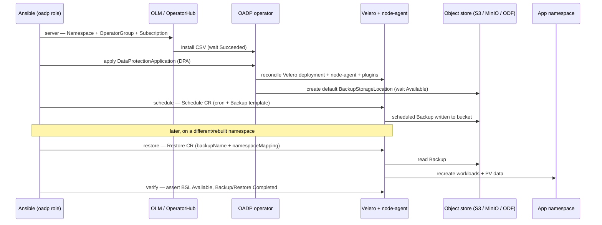

# oadp — role depth doc

Internals, workflow, and operational notes for the `oadp` role (`rhism.platform.oadp`). See the
role `README.md` for the quick-start and the full variable table; this doc is for people using
or maintaining the role in depth — the mechanics, not a variable dump.

## Overview

[OADP (OpenShift API for Data Protection)](https://docs.redhat.com/en/documentation/openshift_container_platform/latest/html/backup_and_restore/oadp-application-backup-and-restore)
is the Red Hat-supported operator for **application-level backup and restore on OpenShift**,
built on upstream [Velero](https://velero.io/). It protects namespaced Kubernetes/OpenShift
resources plus their persistent-volume data to object storage, and restores them — optionally
into a different namespace.

The role's design mirrors OADP's own two-layer CR model, and this split is the key to reading it:

- The **`DataProtectionApplication` (DPA)** — `oadp.openshift.io/v1alpha1` — is the operator's own
  configuration CR. Applying one DPA installs and configures the **entire Velero stack**: the
  Velero deployment, its plugins, the node-agent DaemonSet, and — because backup/snapshot
  locations are declared inline in the DPA spec — the default `BackupStorageLocation` (BSL) and
  optional `VolumeSnapshotLocation` (VSL). **The DPA owns the BSL/VSL**; the role does not create
  them as separate CRs.
- The **worker CRs** — `Backup`, `Schedule`, `Restore`, `BackupStorageLocation`,
  `VolumeSnapshotLocation` (`velero.io/v1`) — are stock Velero. The role assembles and applies
  these to drive day-to-day operations.

Everything lives in one namespace, `backup_oadp_namespace` (default `openshift-adp`), which is
**parameterized, never hardcoded** — every CR the role applies targets that variable.

### How volume data is captured

OADP offers three volume-capture strategies, selectable through the DPA and Backup specs:

- **CSI snapshots** — storage-native snapshots via the CSI driver (the `csi` default plugin).
- **Native cloud snapshots** — provider volume snapshots, declared through a `VolumeSnapshotLocation`.
- **Node-agent filesystem backup** — the node-agent DaemonSet copies pod volumes at the
  filesystem level, using **Kopia** (the modern default) or **Restic** (legacy). This is the
  fallback when the underlying storage has no usable snapshot capability.

The Velero storage `provider` is **`aws` even for MinIO and OpenShift Data Foundation** — "aws"
is Velero's provider name for *any* S3-compatible object store, not a public-cloud dependency.
On-prem endpoints just set an explicit S3 URL and path-style addressing.

## Where it fits

`oadp` is one of the **backup product** roles selected by the `backup_management` dispatcher
(`backup_type`): `restic`, `bareos`, `rear`, `oadp`. A site uses exactly one per protection
domain. Each is a separate, standalone-first role. See
[`docs/backup-management.md`](backup-management.md) for the shared dispatcher interface.

### Dispatcher selection and the shared interface ("sameness")

The role reads the **shared backup family names** (`backup_oadp_*`) — the exact names the
`backup_management` dispatcher exposes in its `defaults/main.yml`. The dispatcher selects the
product with one identical call, passing only the lifecycle step in via `action`:

```yaml
# backup_management selects oadp the same way it selects any product:
- ansible.builtin.include_role:
    name: "{{ backup_type }}"      # oadp
  vars:
    action: "{{ backup_action }}"  # server | client | schedule | verify | restore | baseline
```

Every `backup_oadp_*` value the dispatcher (or a play/group_vars) sets flows straight through
with no per-product mapping. The role ships defaults for all of them, so it also runs standalone
(`roles: [rhism.platform.oadp]`). Standalone, the default `action` is the read-only `verify` — a
safe no-op against an existing stack, deliberately never an unattended operator install. The
interface and action `choices` are declared and validated in `meta/argument_specs.yml` —
ansible-core runs the validation at role entry, so there is no hand-written `assert`. Internal
register/fact names keep the private `_oadp_*` prefix.

**Dispatched action set is narrower than standalone.** The dispatcher's own
`_backup_valid_actions` is the six-step common lifecycle (`server`, `client`, `schedule`,
`verify`, `restore`, `baseline`). The role additionally supports `backup` (an on-demand Backup
CR) for direct standalone callers.

## Action model

`tasks/main.yml` is a flat action fan-out. Two shared assembly files back several actions:
`dpa.yml` (build + apply the DataProtectionApplication) and `backup_spec.yml` (assemble the
Velero Backup spec, reused by both `backup` and `schedule`).

| Action | What it actually does |
|---|---|
| `server` | Installs the operator via **OLM** and configures the full Velero stack: creates the `Namespace`, an `OperatorGroup` targeting it, and a `Subscription` (`redhat-oadp-operator`, `stable` channel, `redhat-operators` source); waits for the `ClusterServiceVersion` `.status.phase == Succeeded`; creates the `cloud-credentials` `Secret` (only when `backup_oadp_cloud_credentials` is supplied — otherwise the Secret is assumed provisioned out of band, e.g. IRSA/STS); applies the **DPA** (via `dpa.yml`); waits for the `BackupStorageLocation` `.status.phase == Available`. |
| `client` | Per-application enablement. OADP is agentless on the app side (the node-agent runs on the cluster), so this is thin: it labels/annotates the application namespace (`backup_oadp_client_*`) so its workloads opt into filesystem backup and hooks. Asserts `backup_oadp_client_namespace` is set. |
| `schedule` | Applies a Velero `Schedule` CR — a cron expression plus a Backup **template** (the shared spec from `backup_spec.yml`, with `ttl` overridden by `backup_oadp_schedule_ttl`). Velero creates a `Backup` from the template on each tick. Asserts `backup_oadp_schedule_name` is set. |
| `backup` | Applies an on-demand Velero `Backup` CR (spec from `backup_spec.yml`) and, when `backup_oadp_wait`, polls until `.status.phase == Completed`. Asserts `backup_oadp_backup_name` is set. |
| `verify` | Read-only health check. Gathers the BSL status, Velero pods, node-agent pods, and (when a name is given) the named Backup, then asserts the BSL is `Available`, a Velero pod is `Running`, and the named Backup reached `Completed`. Makes no changes. |
| `restore` | Applies a Velero `Restore` CR referencing `backup_oadp_restore_backup_name` (a Backup, or a Schedule whose latest Backup is used), with `namespaceMapping`, `restorePVs`, and `existingResourcePolicy` (`none` = leave present resources, `update` = patch), then waits for `Completed`. Asserts both restore name and backup name are set. |
| `baseline` | Orchestrates `server → schedule → verify`, each gated on its `backup_oadp_apply_*` toggle (schedule defaults **off**, so a narrowed baseline of server + verify is the common path). |

### The DPA assembly (`dpa.yml`)

`dpa.yml` builds the DPA definition from the shared vars and applies it. It constructs the BSL
config block conditionally — `region` always, plus `s3Url` / `s3ForcePathStyle` /
`insecureSkipTLSVerify` only when set (the MinIO/ODF path) — and the `snapshotLocations` list
only when `backup_oadp_snapshot_location_enabled`. The `backupLocations` entry is marked
`default: true` and carries the object-store bucket/prefix and the credential Secret reference.
Applying the DPA notifies the `oadp - wait for velero rollout` handler, which polls the `velero`
Deployment for `availableReplicas >= 1`.

Because `backupLocations`/`snapshotLocations` are declared **inline in the DPA**, do not also
create BSL/VSL as separate CRs unless you are adding *extra* locations beyond the DPA-owned
defaults.

## Configuration model

The role is organised around three configuration surfaces, all under the `backup_oadp_*` family:

- **Operator/DPA install surface** — namespace, OLM subscription coordinates, DPA name, default
  plugins (`aws`/`openshift`/`csi`), node-agent enable + uploader type. Consumed by `server` +
  `dpa.yml`.
- **Storage surface** — provider (`aws` for any S3-compatible store), bucket/prefix/region, the
  optional explicit `s3_url` + path-style toggle for MinIO/ODF, TLS-skip, and the credentials
  Secret name/key/content. `backup_oadp_cloud_credentials` is vault-backed and, when empty,
  signals "the Secret is provisioned out of band."
- **Workload surface** — which namespaces/resources a Backup includes, the label selector,
  snapshot-volumes and default-fs-backup toggles, retention `ttl` (Velero duration string;
  `720h0m0s` = 30 days), schedule cron, and the restore mapping/policy fields.

Waits are uniform: `backup_oadp_wait` gates them, and `backup_oadp_wait_timeout` (seconds) is
divided by the fixed 10-second poll to derive the retry count for every readiness loop (CSV, BSL,
Backup, Restore, Velero rollout).

## Day-2 operations

- **Scheduled backups.** Use `schedule` with `backup_oadp_schedule_cron` + `backup_oadp_included_namespaces`;
  retention for schedule-created Backups is `backup_oadp_schedule_ttl`. `backup_oadp_schedule_paused`
  creates it paused.
- **On-demand backups.** `backup` with a `backup_oadp_backup_name` for ad-hoc protection before a
  risky change.
- **Retention.** Velero expires Backups by their `ttl`; nothing else prunes them, so set `ttl`
  deliberately per Schedule/Backup rather than relying on external cleanup.
- **Health before reliance.** Run `verify` before trusting the service for a recovery — it
  confirms the BSL is `Available`, Velero + node-agent are up, and (optionally) a specific Backup
  `Completed`.
- **Restore into a mapped namespace.** `restore` with `backup_oadp_restore_namespace_mapping`
  relocates workloads on the way back in; `existingResourcePolicy` controls collisions.

## Testing tiers

Honest picture of what is proven where:

- **Tier-1 contract ONLY in CI (`molecule/default`).** OADP has no dry-run gate and every
  operational action applies CRs to a **real OpenShift cluster with OLM and object storage**,
  which CI does not have. So the scenario runs entirely on the control host (`hosts: localhost`):
  it loads defaults, runs the argument-spec negative test (a bogus action is rejected at role
  entry — the role loads fine on Linux), asserts the standalone default contract, renders a
  Velero `Backup` CR client-side and asserts its structure (`apiVersion`/`kind`/spec shape), and
  stats that every dispatch task file exists. No cluster, no operator, no bucket.
- **Tier-3 lab (not in CI) — OCP + MinIO.** Real operator install, "backup lands in the bucket,"
  and "restore recreates workloads" require a genuine OpenShift cluster plus S3-compatible object
  storage. This is the **same boundary** the platform draws for `k3s`/`rke2`/`ocp` and the
  AAP/AWX operator installs — anything needing a live cluster is a Tier-3 lab concern. In
  `REQUIREMENTS.yml`, `OADP-FR-002/003/004/006/007` are `tier: 3`, `verified_by`
  `manual: not yet executed`; only the contract-provable requirements (`OADP-FR-001`,
  `OADP-FR-005`) are covered by molecule today.

There is deliberately no Tier-2 middle ground here: unlike `rear` (whose data-backup path runs
for real in a container), OADP's smallest meaningful functional unit is the operator itself, and
the operator needs OLM and a cluster. The role is precise about that rather than pretending a
container run proves it.

## Workflow



## Related information

- Role `README.md` — quick-start, full variable table, example playbooks (standalone and via
  dispatcher), Molecule test results.
- [`docs/backup-management.md`](backup-management.md) — the backup product family and the shared
  dispatcher interface.
- `roles/oadp/REQUIREMENTS.yml` — capability-lens functional requirements and their
  verification tiers.
- [Red Hat OADP documentation](https://docs.redhat.com/en/documentation/openshift_container_platform/latest/html/backup_and_restore/oadp-application-backup-and-restore)
  and [upstream Velero](https://velero.io/) — the DPA and `velero.io/v1` CRs
  (`Backup`, `Schedule`, `Restore`, `BackupStorageLocation`, `VolumeSnapshotLocation`) referenced
  above.
