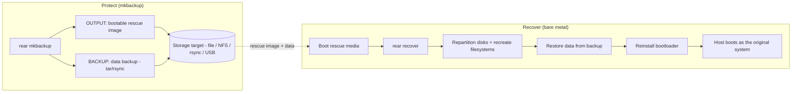

# rear — role depth doc

Internals, workflow, and operational notes for the `rear` role (`rhism.platform.rear`). See the
role `README.md` for the quick-start and the full variable table; this doc is for people using
or maintaining the role in depth — the mechanics, not a variable dump.

## Overview

[Relax-and-Recover (ReaR)](https://relax-and-recover.org/) is the standard RHEL/Linux
**bare-metal disaster-recovery** tool. It is not a general file-backup product: its job is to
make a failed or destroyed host recoverable onto replacement hardware from scratch. The role
installs ReaR and its method-matched tooling, renders the ReaR configuration into `/etc/rear`,
schedules unattended protection through a systemd timer, runs read-only recovery-readiness
checks, and — behind a deliberate double gate, lab-only — drives a full bare-metal recover.

The single most important thing to understand about ReaR is that it emits **two independent
artifacts**, and the role's whole configuration model is built around that split:

- **OUTPUT** — a bootable **rescue image** (ISO/USB/PXE/RAWDISK/OBDR/RAMDISK). This is *how you
  boot* a bare machine into a recovery environment that knows the original system's disk layout,
  bootloader, network, and storage stack.
- **BACKUP** — a **data backup** (tar or rsync to NETFS/RSYNC/BORG/DUPLICITY/… targets). This is
  *what gets restored* once the rescue image has re-created the disk layout.

Recovery needs both: the rescue image rebuilds the machine's skeleton (partitions, filesystems,
bootloader), then the data backup refills it. ReaR's `OUTPUT_URL` falls back to `BACKUP_URL`
when unset, so the two artifacts can share one storage target — but they are configured as two
separate variable groups precisely because a site often wants them apart (small rescue images on
fast local/USB media for quick boot; large data backups on a bulk NFS/rsync share).

## Where it fits

`rear` is one of the **backup product** roles selected by the `backup_management` dispatcher
(`backup_type`): `restic`, `bareos`, `rear`, `oadp`. A site uses exactly one per protection
domain. Each is a separate, standalone-first role. See
[`docs/backup-management.md`](backup-management.md) for the shared dispatcher interface.

### Dispatcher selection and the shared interface ("sameness")

The role reads the **shared backup family names** (`backup_rear_*`) — the exact names the
`backup_management` dispatcher exposes in its `defaults/main.yml`. The dispatcher selects the
product with one identical call, passing only the lifecycle step in via `action`:

```yaml
# backup_management selects rear the same way it selects any product:
- ansible.builtin.include_role:
    name: "{{ backup_type }}"      # rear
  vars:
    action: "{{ backup_action }}"  # server | client | schedule | verify | restore | baseline
```

Every `backup_rear_*` value the dispatcher (or a play/group_vars) sets flows straight through
with no per-product mapping. The role ships defaults for all of them, so it also runs standalone
(`roles: [rhism.platform.rear]`) with no dispatcher required. Standalone, the default `action`
is `backup` (take a full protection set). The interface and the action `choices` are declared and
validated in `meta/argument_specs.yml` — ansible-core runs the validation at role entry, so
there is no hand-written `assert`. Internal register/fact names keep the private `_rear_*`
prefix and are the only exception to the family namespace.

**Dispatched action set is narrower than standalone.** The dispatcher's own
`_backup_valid_actions` is the six-step common lifecycle (`server`, `client`, `schedule`,
`verify`, `restore`, `baseline`). The role additionally supports `backup` (and `present`/`absent`
package management) for direct standalone callers who want to drive an individual protection run
without going through the dispatcher.

## Action model

`tasks/main.yml` is a flat action fan-out (`include_tasks` gated on `action == '<name>'`).
Package actions (`present`/`absent`) share `install.yml` via `state: "{{ action }}"`; every other
action has its own file.

| Action | What it actually does |
|---|---|
| `server` | Prepares/validates the **storage target** the rescue image + data backup point at. ReaR has no server daemon — the "server" is the repository. Asserts `backup_rear_backup_url` is set, resolves its URL scheme, and for a `file://` scheme ensures `backup_rear_server_local_dir` exists (`0750`, root). For remote schemes (NFS/rsync/CIFS) a dedicated storage role owns the export; this action just anchors and reports. |
| `client` | Full client setup on a protected host. Resolves the method-matched package set (see Configuration model), installs ReaR + those deps, then includes `configure.yml` to render `/etc/rear`. |
| `schedule` | Renders the config first (so retention/backup-type land in `local.conf`), deploys the `rear-mkbackup.service` (`Type=oneshot`) + `rear-mkbackup.timer` (`OnCalendar`) units, then enables+starts or disables+stops the timer per `backup_rear_schedule_enabled`. Default timer command is the upstream-robust `rear checklayout || rear mkrescue`. |
| `backup` | Runs a ReaR backup. `backup_rear_backup_mode` selects the sub-mode: `mkbackup` (rescue image **+** data backup), `mkbackuponly` (data backup only, assumes a current rescue image), `mkrescue` (rescue image only). Asserts `local.conf` exists first (run `client`/`baseline` before backing up). |
| `verify` | Read-only recovery-readiness probe with three signals: `rear dump` (effective OUTPUT/BACKUP config resolves), `rear checklayout` (rc 0 = layout matches the last rescue image; non-zero = disk layout drifted and the image is stale), and an artifact-freshness `find` asserting a real rescue ISO or `backup.tar.gz` exists at the target. Never writes a backup, never repartitions — drift is surfaced as a finding, not a task failure. |
| `restore` | The real, live, **irreversible** `rear recover` — repartitions disks and reinstalls the bootloader from the rescue image + data backup. **Fails closed** unless **both** `backup_rear_recover_execute` **and** `backup_rear_recover_confirm_irreversible` are explicitly `true` (a deliberate double gate, so a single leftover flag can never trigger a real disk rewrite). Normally run from the booted rescue environment; driven here only for a Tier-3 KVM lab against a throwaway target. Never enabled in CI. |
| `baseline` | Orchestrates a full stand-up: `server → client → schedule → verify`, each phase gated on its `backup_rear_apply_*` toggle. `restore` is deliberately **not** part of baseline (destructive/lab-only). |
| `present` / `absent` | Manage just the `rear` package (`state: "{{ action }}"`). |

### The double gate on `restore`

`rear recover` is the one genuinely destructive action in the family. The role refuses it unless
both gates are set together, and asserts that **before** anything else runs:

- `backup_rear_recover_execute` — the "yes, actually run it" flag.
- `backup_rear_recover_confirm_irreversible` — a separate acknowledgement that disks will be
  repartitioned and the bootloader reinstalled with no rollback.

This is the same pattern the platform uses for other irreversible operations (e.g.
`convert2rhel`'s conversion gate): a single flag is too easy to leave set from a prior run.

## Configuration model

ReaR reads `/etc/rear/` in a fixed order — the shipped `default.conf` (in
`/usr/share/rear/conf/`), then `site.conf`, then `local.conf` — with later files overriding
earlier ones. The role **templates `local.conf`** (per host) and **optionally `site.conf`**
(fleet-wide, when `backup_rear_manage_site_conf` is true); it **never** touches the shipped
`default.conf`. The rendered files are plain `VAR=value` bash, exactly what ReaR expects.

`local.conf.j2` renders the two artifact groups as two blocks:

- **OUTPUT block** — `OUTPUT` (format), optional `OUTPUT_URL` (only when set — otherwise ReaR
  falls back to `BACKUP_URL`), optional `GRUB_RESCUE=y`.
- **BACKUP block** — `BACKUP` (method), `BACKUP_URL`, `BACKUP_PROG`, appended
  `BACKUP_PROG_EXCLUDE`, optional `NETFS_KEEP_OLD_BACKUP_COPY`, and (for incremental/differential)
  `BACKUP_TYPE` + `FULLBACKUPDAY`. `TMPDIR` closes the file.

`local.conf` is rendered `0600` (it can name backup targets/credentials); `site.conf` is `0644`.

### Method-matched package resolution (the `client` action)

`client.yml` composes the install set from the base `rear` package plus dependencies chosen by
**both RHEL major version and architecture** — the two real ReaR arch/media constraints:

- **ISO/media builder** — only added when the OUTPUT format produces bootable media
  (`ISO`/`USB`/`PXE`/`OBDR`). RHEL 9/10 build ISOs with `xorriso`; RHEL 7/8 use `genisoimage`.
- **BIOS bootloader** — `syslinux` is added only on `x86_64` (it is x86-only); EFI architectures
  boot the rescue media via `grub2` and need no syslinux.
- **Backup method tooling** — `NETFS→nfs-utils`, `RSYNC→rsync`, `BORG→borgbackup`,
  `DUPLICITY→duplicity`, etc.
- **URL-scheme transport** — the backup URL's scheme adds mount/transport tooling
  (`nfs→nfs-utils`, `cifs→cifs-utils`, `sshfs→fuse-sshfs`, …).

The composed list is `unique`-filtered before a single `package` call installs it.

## Day-2 operations

- **Scheduled protection.** The `schedule` action's default timer command,
  `rear checklayout || rear mkrescue`, is the upstream-recommended robust pattern: cheaply verify
  the rescue image still matches the live layout, and rebuild it only when the layout changed.
  Switch `backup_rear_schedule_command` to `/usr/sbin/rear mkbackup` for full data+image
  protection on every run. Cadence is `backup_rear_schedule_oncalendar` (a systemd `OnCalendar`
  expression).
- **Recovery-readiness checks.** Run `verify` regularly (it is part of `baseline`). Its
  `checklayout` signal is the early warning that a disk was repartitioned/grown since the last
  rescue image — meaning the image is stale and a real recovery would fail on a mismatched
  layout. Rebuild with `mkrescue` when that fires.
- **Retention / rotation.** `backup_rear_keep_old_backup_copy` keeps the previous data backup
  alongside the new one. For rotation, set `backup_rear_backup_type` to `incremental` or
  `differential` and `backup_rear_fullbackup_day` to force a periodic full.
- **Restore.** Only ever with both gates set, against a throwaway/replacement target — see the
  double-gate note above.

## Testing tiers

Honest picture of what is proven where:

- **Tier-1 contract (`molecule/default`).** Control-host converge (`hosts: localhost`): loads
  defaults, runs the argument-spec negative test (a bogus action is rejected at role entry),
  asserts the standalone default contract, and stats that every dispatch task file exists. No
  ReaR install, no storage. Validates the interface, dispatch, and the shared-variable contract.
- **Tier-2 functional (`molecule/functional`) — passes in CI.** On a privileged AlmaLinux 9
  container it **actually installs ReaR**, runs `client` to render `/etc/rear` pointing both
  OUTPUT and BACKUP at a `file://` target on a separate tmpfs mount, resolves the config with
  `rear dump`, runs `rear checklayout`, and produces a **real `backup.tar.gz`** via `backup`
  mode `mkbackuponly` — asserted in `verify.yml`. It *attempts* `rear mkrescue` but is tolerant
  of its failing (see the container limit below); the reliable, container-friendly signal is the
  data backup, so the scenario never depends on the ISO build. A small test-only shim pins a
  placeholder `KERNEL_FILE` so ReaR's prep guard passes in a container with no `/boot` kernel —
  the produced tar is a real tar of the real filesystem, unaffected.
- **Tier-3 KVM lab (not in CI).** Full `mkrescue` bootable ISO plus an end-to-end `rear recover`
  need a real KVM guest and are inherently destructive (they repartition disks). This is the only
  place `restore` (with both gates set) is exercised. Tracked as `REAR-FR-005`, `verified_by`
  `manual: not yet executed`.

### Real ReaR container/arch limits

- **ISO/bootloader tooling is architecture-specific.** `syslinux` (the BIOS bootloader ReaR
  packs into a rescue ISO) is x86_64-only; EFI arches boot via `grub2`. The ISO builder itself
  differs by RHEL major (`xorriso` on EL9/10, `genisoimage` on EL7/8). The `client` action
  resolves the right set automatically, but there is no single portable package.
- **ReaR cannot run its full rescue workflow in a container.** `mkrescue` reads live
  block-device, bootloader, and kernel-module context and probes `/boot`; a container shares the
  host kernel and has no real bootloader stack, so the rescue-image and recover workflows are a
  bare-metal/VM concern. This is why the functional scenario proves the data-backup path for real
  and treats the ISO build as best-effort.

## Workflow



Between the two halves sits the `verify` loop: `rear checklayout` continuously answers "does the
current rescue image still match this machine's disk layout?" — catching drift before a real
recovery ever depends on the answer.

## Related information

- Role `README.md` — quick-start, full variable table, example playbooks (standalone and via
  dispatcher), Molecule test results.
- [`docs/backup-management.md`](backup-management.md) — the backup product family and the shared
  dispatcher interface.
- `roles/rear/REQUIREMENTS.yml` — capability-lens functional requirements and their
  verification tiers.
- [Relax-and-Recover project documentation](https://relax-and-recover.org/) — upstream config
  directives referenced above (`OUTPUT`, `BACKUP`, `OUTPUT_URL`, `BACKUP_URL`, `GRUB_RESCUE`,
  `NETFS_KEEP_OLD_BACKUP_COPY`, `BACKUP_TYPE`, `FULLBACKUPDAY`, `checklayout`, `mkrescue`,
  `mkbackup`, `recover`).
