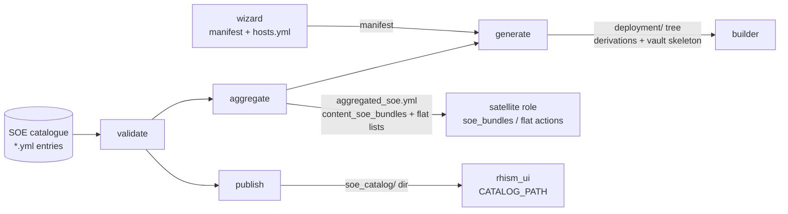

# rhism_inventory — SOE catalogue owner (depth doc)

`rhism.platform.rhism_inventory` is the standalone capability role that owns
the **SOE (Standard Operating Environment) catalogue**: the per-OS-build
definitions (content, provisioning templates, lifecycle objects) an estate's
content-management server is configured from. It validates the catalogue,
aggregates any selection of builds into the flat input set the `satellite`
role consumes, generates the high-signal deployment inventory content from an
estate manifest, and publishes the catalogue for the `rhism_ui` web browser.

It is an aligned, enhanced version of the upstream RHIS generator (`rhis-builder-inventory`),
which fans a ~46-line basevars file out into ~34,000 generated lines. This
role produces only the content that carries signal (see the variable-model
analysis in the platform's rhism docs) and deliberately fixes the upstream
defects listed at the bottom.

## Position in the rhism flow



- **wizard** stays the owner of estate identity/topology (`hosts.yml`
  groups). This role never re-renders groups; `generate` consumes the
  wizard's manifest.
- **satellite** stays the owner of execution against a live Satellite. This
  role produces its input, never talks to a server.
- **rhism_ui** serves whatever `publish` writes — one YAML file per entry,
  individually parseable (its `loadCatalog` contract).

## Catalogue entry schema

One YAML file per entry (see `files/catalog/README.md` for provenance of the
bundled reference entries):

```yaml
name: rhel9_soe                 # required — the entry's identity
lifecycle_state: active         # optional: active | deprecated | experimental
content:                        # ≥1 of content/templates/lifecycle required
  repository_sets: [...]
  custom_products: [...]
  content_views: [...]          # each: name + repositories[]
templates:
  provisioning_templates: [...]
  partition_tables: [...]
  snippets:                     # priority:name ordering (upstream RFC)
    - {priority: 100, name: ...}
lifecycle:
  lifecycle_environments: [...] # ORDER = the promotion path
  activation_keys: [...]        # each: name + lifecycle_environment (+ content_view)
  hostgroups: [...]
infrastructure_refs:            # assertions against existing site infra —
  compute_resource: ...         # validated, never created (upstream §3.3);
  subnet: ...                   # only these four keys are accepted
  domain: ...
  realm: ...
```

## Shared envelope (every action)

`tasks/main.yml` runs for all four actions, in order:

1. **Eager catalogue-dir resolution** — `rhism_inventory_catalog_dir` empty →
   the role's own `files/catalog/`, frozen to a concrete string via
   `set_fact` (a raw `role_path` template re-resolves against the wrong role
   when passed downstream — BUG-166 class).
2. **Load** — every `*.yml` under the catalogue dir, parsed individually; an
   empty catalogue is an explicit failure, not a silent no-op.
3. **Lifecycle filter** — entries with `lifecycle_state: deprecated` are
   dropped when `rhism_inventory_lifecycle_filter` is true (default). The
   entries stay in the catalogue on disk; they are excluded from *use*.
4. **Name selection** — `rhism_inventory_bundles` non-empty keeps only the
   named entries.
5. Dict-form `include_tasks: {file: ...}` dispatch (BUG-084).

## Action mechanics

### validate (default, read-only)

Asserts, per selected entry: `name` present; at least one of
`content`/`templates`/`lifecycle`; every `snippets` item is
`{priority: <int>, name: <str>}`; `infrastructure_refs` carries only the four
known keys; `lifecycle_state` (when present) is one of the three states.
Reports a summary (accepted count, names, dropped-deprecated). Nothing is
written.

### aggregate

Produces ONE `include_vars`-ready file (default
`{{ rhism_inventory_output_dir }}/aggregated_soe.yml`) containing:

- **`content_soe_bundles`** — one satellite-role bundle per
  *(entry × activation key)*. The satellite role's `soe_bundles` action
  asserts a flatter per-key shape than a catalogue entry, so this is a
  transform, not a pass-through: `lifecycle_environment_prior` is derived
  from the entry's `lifecycle_environments` **order** (the promotion path;
  first environment promotes from `Library`), and `repositories` is carried
  from the activation key's matching content view.
- **Flat deduplicated lists in the satellite role's own variable names** —
  `content_cdn_repository_sets`, `content_products`,
  `content_lifecycle_environments`, `content_views`,
  `content_activation_keys` — merged across all selected entries,
  deduplicated by object name. `content_hostgroups` is also emitted as the
  natural family name; note the satellite role has no hostgroups consumer
  variable today (its bundle model treats hostgroups as by-name reference
  metadata).
- **`content_presync_sources`** — the sync gate (upstream §2.2): every
  content section across all selected bundles in one deduplicated pre-sync
  list, so all content syncs once before any per-build configuration.

### generate

Input: a wizard deployment manifest (`rhism_inventory_manifest_path`) or the
standalone fallbacks (`rhism_inventory_domain` +
`rhism_inventory_network_cidr` — both required when no manifest). Output tree
under `{{ rhism_inventory_output_dir }}/deployment/`:

- `group_vars/all/derived.yml` — domain, realm (upper-cased domain unless
  the manifest carries one), `rhism_dns_server_ip` =
  `nthhost(rhism_inventory_dns_host_offset)` of the **full CIDR** (upstream
  parity: `next_nth_usable(10)`), `rhism_gateway_ip` =
  `nthhost(rhism_inventory_gateway_offset)`, `rhism_reverse_dns_zones` —
  the exact set of `in-addr.arpa` zones covering the defined network at any
  prefix length (a /22 yields its four /24 children, never the single
  classful zone), time-server passthrough.
- `group_vars/all/aggregated_soe.yml` — the aggregate output, written into
  the tree by reusing `tasks/aggregate.yml` via `include_tasks` with a
  destination override (one implementation, no copy).
- `vault/` — mode `0700`, containing only a README explaining that secrets
  travel outside generated artifacts by construction. No secret value is
  ever generated.

### publish

Copies the selected + filtered entries into
`{{ rhism_inventory_publish_dir }}` as flat `<name>.yml` files — exactly the
`rhism_ui` backend's `CATALOG_PATH` contract (`readdir` of `*.yml`, each file
parsed as one entry). Point the UI's `CATALOG_PATH` at this directory.

## Requirements & EE note

The derivations use `ansible.utils` IP filters, which need the **`netaddr`**
Python library on the controller. In this platform's EE line-up:
`ansible_galaxy_net_ee` carries both; the infra EE carried the collection
without `netaddr` until the fix recorded in the platform bug register (the
role's CI ran against the net EE when that gap was live). The base EE has
neither.

## Testing (Tier 2 — the control node IS the target)

The `default` molecule scenario runs the real thing end to end: reference
catalogue + fixtures (a duplicate-object entry to prove dedup, a deprecated
entry to prove the filter, a schema-invalid entry + a bogus action for the
negative plays, a /22 manifest). Verify asserts real artifacts: the
aggregated file parses with the expected bundle count, the shared content
view and repository set appear exactly once, the promotion-path prior is
correct, `dns=.0.10`/`gateway=.0.1` on `10.20.0.0/22`, the reverse zones are
the four /24 children **and explicitly not** the naive classful answer, the
vault skeleton is `0700`, and the published files parse with the deprecated
entry absent. Negative plays use `block`/`rescue`, never `ignore_errors`.

## Upstream defects deliberately fixed here

| Upstream behavior | This role |
|---|---|
| Classful octet-split network derivation, only correct for /24 — while shipping a /22 default | Full-CIDR `ansible.utils` derivation, asserted on a /22 in CI |
| 34k generated lines, most of it prune-by-hand boilerplate + a near-duplicate disco tree | Only the high-signal content: derivations, aggregated SOE chain, vault skeleton |
| `FQD.` hardlink rename hack for domain-bearing filenames | No filename encoding; domain lives in content |
| Secrets chicken-and-egg (sample vault template in-tree) | Empty `0700` vault skeleton; secrets never enter generated artifacts |
| Deprecation by deletion | `lifecycle_state` tagging + default-on filter; history stays |

## Related

- Role README: `roles/rhism_inventory/README.md` (interface + examples)
- Requirements register: `roles/rhism_inventory/REQUIREMENTS.yml`
- Consumers: `roles/satellite` (`soe_bundles` + flat actions), `rhism_ui`
  (`CATALOG_PATH`), `wizard` (manifest producer)
